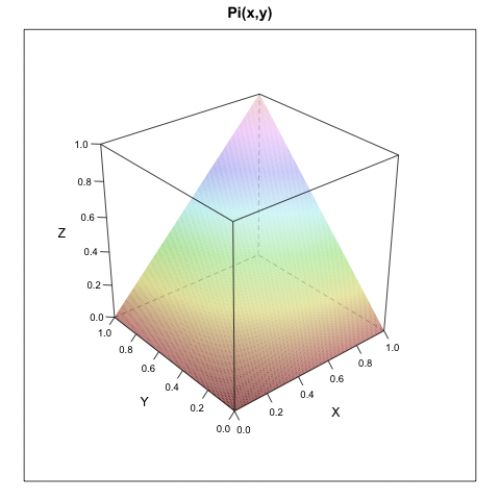

[](http://quantlet.de/)

## [](http://quantlet.de/) **MSR_Frechet_bounds** [](http://quantlet.de/)

```yaml

Name of Quantlet: MSR_Frechet_bounds

Published in: Measuring Statistical Risk

Description: 'Plots the three copula functions: maximum (M(x,y)), minimum (W(x,y)) and product (P(x,y))'

Keywords: copula, Frechet, tail, plot, graphical representation

Author: Zografia Anastasiadou, Ye Hua
Author[Matlab]: Barbara Choros

Submitted: Fri, April 08 2011 by Maria Osipenko


```





### R Code
```r


rm(list=ls(all=TRUE))
#setwd("C:/...")

#install.packages("lattice")
library(lattice)

x  = seq(0, 1, by = 0.01)
y  = x
m  = length(x)
n  = length(y)
X  = matrix(rep(x, each = n), nrow = n)
Y  = matrix(rep(y, m), nrow = n)
m  = pmin(X, Y)
w  = pmax(X + Y - 1, 0)
pi = X * Y

s = expand.grid(x = x, y = y)
wireframe(m ~ x * y, s, shade = TRUE, 
          xlab = "X", ylab = "Y", 
          zlab = "Z", main = "M(x,y)", 
          scales = list(arrows = FALSE))

s = expand.grid(x = x, y = y)
wireframe(w ~ x * y, s, shade = TRUE, 
          xlab = "X", ylab = "Y", zlab = "Z", 
          main = "W(x, y)", scales = list(arrows = FALSE))

s = expand.grid(x = x, y = y) 
wireframe(pi ~ x*y, s, shade = TRUE, xlab = "X", ylab = "Y", zlab = "Z",
    main = "Pi(x, y)", scales = list(arrows = FALSE))

```

automatically created on 2018-05-28

### MATLAB Code
```matlab


function MSR_Frechet_bounds
x      = 0:0.01:1;
[x, y] = meshgrid(x);
m      = min(x, y);
w      = max(x + y - 1, 0);
Pi     = x.*y;

figure
mesh(x, y, m);
xlabel('X');
ylabel('Y');
zlabel('Z');
title('M(x, y)')
grid on 
figure
mesh(x, y, w);
xlabel('X');
ylabel('Y');
zlabel('Z');
title('W(x, y)')
grid on
figure
mesh(x, y, Pi)
xlabel('X');
ylabel('Y');
zlabel('Z');
title('\\Pi(x, y)')

```

automatically created on 2018-05-28