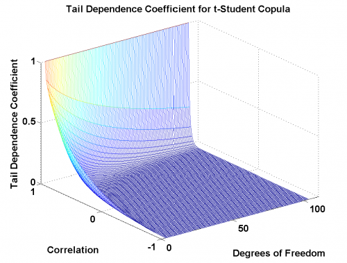

[](http://quantlet.de/)

## [](http://quantlet.de/) **MSR_TDC_tStudent** [](http://quantlet.de/)

```yaml

Name of Quantlet: MSR_TDC_tStudent

Published in: Measuring Statistical Risk

Description: 'Plots the tail dependence coefficient of t-Student copula as the function of correlation and the number of degrees of freedom.'

Keywords: DoF, copula, correlation, tail, plot, 3D

See also: 'MSRbayer_log_returns, MSRportfolio_est, MSRstdlogret, MSRtail_dep_normal, MSRtail_dep_tStudent, MSRtcopulaparam, MSRvar_block_max, MSRvar_block_max_params, MSRvar_clayton_GARCHn'

Author: Zografia Anastasiadou
Author [Matlab]: Barbara Choros-Tomczyk, 


```




### R Code
```r

rm(list = ls(all = TRUE))
# setwd('C:/...')

install.packages("lattice")
#library(lattice)

d = 3:103
r = seq(-1, 1, by = 0.02)
m = length(d)
n = length(r)
D = matrix(rep(d, each = n), nrow = n)
R = matrix(rep(r, m), nrow = n)

x = t(R)
y = t(D)
N = length(x)

t = 2 - 2 * pt(sqrt(y + 1) * sqrt(1 - x)/sqrt(1 + x), y + 1)

s = expand.grid(d = d, r = r) 

wireframe(t ~ d*d, s, shade = TRUE, xlab = "Degrees of Freedom",
    ylab = "Correlation", zlab = "Tail Dep Coef", 
    main = "Tail Dependence Coefficient for t-Student Copula", 
    scales = list(arrows = FALSE))

```

automatically created on 2018-09-04

### MATLAB Code
```matlab


function MSR_TDC_tStudent
d     = 3:103;
r     = -1:.02:1;
[r,d] = meshgrid(r, d);
x     = r(:);
y     = d(:);
N     = length(x);
t     = 2 - 2*tcdf(sqrt(y + 1).*sqrt(1 - x)./sqrt(1 + x), y + 1);
f     = reshape(t, sqrt(N), []);

figure;
mesh(d, r, f);
axis([0 110 -1 1 0 1])
xlabel('DoF');
ylabel('rho');
zlabel('TDC');
xlabel('Degrees of Freedom');
ylabel('Correlation');
zlabel('Tail Dependence Coefficient');
title('Tail Dependence Coefficient for t-Student Copula')
```

automatically created on 2018-09-04