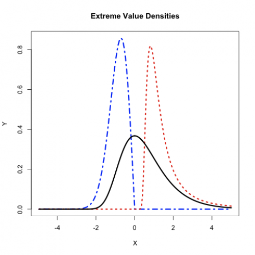

[](http://quantlet.de/)

## [](http://quantlet.de/) **MSRevt1** [](http://quantlet.de/)

```yaml

Name of Quantlet: MSRevt1 

Published in: Measuring Statistical Risk

Description: 'Computes and displays extreme value distributions: Frechet, Gumbel and Weibull.'

Keywords: Frechet, Weibull, gumbel, extreme-value, distribution

See also: MSRevt2, MSRevt3

Author: Juergen Franke

Submitted: Thu, May 29 2008 by Vladimir Georgescu

```




### R Code
```r


rm(list=ls(all=TRUE))
setwd("C:/...")

install.packages("evd")
library(evd)

n     = 100
sp    = 5
xpos  = sp * (1 : n)/n
xneg  =  - sp + xpos
x     = c(xneg, xpos)

alpha = 1/2
gumb  = cbind(x, dgev(x))
frec  = cbind(x, dgev(x, 1, 0.5, alpha))
weib  = cbind(x, dgev(x, -1, 0.5, - alpha))

plot(weib,  type = "l", col = "blue", lwd = 3, lty = 4, xlab = "X", 
    ylab = "Y", main = "Extreme Value Densities")
lines(frec, type = "l", col = "red", lwd = 3, lty = 3)
lines(gumb, type = "l", col = "black", lwd = 3)
```

automatically created on 2018-05-28

### MATLAB Code
```matlab

clear
n    = 100;
sp   = 5;
xpos = sp*(1:n)/n;
xneg = -sp + xpos;
x    = [xneg,xpos]';

alpha = 1/2;
gumb  = [x gevpdf(x)];
frec  = [x gevpdf(x, alpha, 0.5, 1)];
weib  = [x gevpdf(x, -alpha, 0.5, -1)];

hold on
plot(gumb(:, 1), gumb(:, 2), 'k', 'LineWidth', 2, 'LineStyle', '-')
plot(frec(:, 1), frec(:, 2), 'r', 'LineWidth', 2, 'LineStyle' , ':')
plot(weib(:, 1), weib(:, 2), 'b', 'Linewidth', 2, 'LineStyle', '-.')
title('Extreme Value Densities')
xlabel('X')
ylabel('Y')
hold off
```

automatically created on 2018-05-28