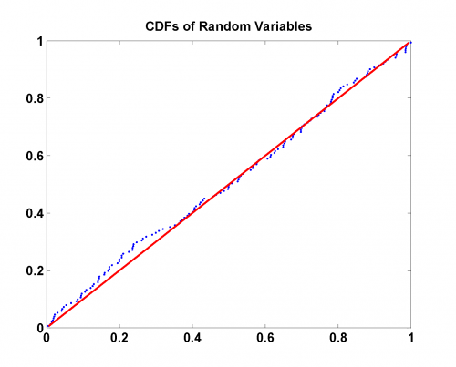

[](http://quantlet.de/)

## [](http://quantlet.de/) **MSRevt3** [](http://quantlet.de/)

```yaml

Name of Quantlet: MSRevt3

Published in: Measuring Statistical Risk

Description: 'Produces a PP plot of the pseudo random variables with Gumbel distribution against theoretical Gumbel 
distribution.'

Keywords: gumbel, random, distribution, extreme-value, pp-plot

See also: 'MSRevt1, MSRevt2, MSRportfolio_est, MSRstdlogret, MSRtail_dep_normal, MSRtail_dep_tStudent, MSRvar_block_max, MSRvar_block_max_params, MSRvar_clayton_GARCHn'

Author: 'Barbara Choros-Tomczyk , Wolfgang K. Härdle '

Output: 'PP plot.'
```



### R Code
```r

rm(list = ls(all = TRUE))
#setwd("C:/...")

#install.packages("evd")
library(evd)

set.seed(123)
n    = 150
xf1  = rgumbel(n)
xf   = sort(xf1)
t    = c(1:n)/(n + 1)
dat  = cbind(pgumbel(xf), t)
dat2 = cbind(t, t)

plot(dat, col = "blue", pch = 20, xlab = "", ylab = "", main = "CDFs of Random Variables") 
lines(dat2, col = "red", lwd = 3)
```

automatically created on 2018-05-28

### MATLAB Code
```matlab

clear
close all
clc

n    = 150;
xf1  = evrnd(0, 1, n, 1);
xf   = sort(xf1);
t    = (1:n)/(n + 1);
dat  = [evcdf(xf), t'];
dat2 = [t', t'];
hold on
scatter(dat(:, 1), dat(:, 2), '.')
plot(dat2(:, 1), dat2(:, 2), 'r', 'LineWidth', 2)
hold off
title('CDFs of Random Variables')

```

automatically created on 2018-05-28