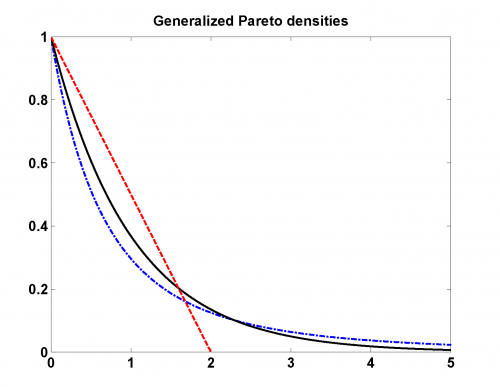
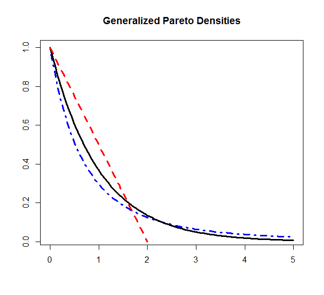

[](http://quantlet.de/)

## [](http://quantlet.de/) **MSRgpdist** [](http://quantlet.de/)

```yaml

Name of Quantlet: MSRgpdist

Published in: Measuring Statistical Risk

Description: 'Generates generalized Pareto densities for different shape parameters and plots the resulting densities.'

Keywords: pareto, heavy-tailed, plot, distribution, density

Author: Zografia Anastasiadou
Author[Matlab]: Barbara Choros-Tomczyk

Submitted: Fri, May 30 2008 by Vladimir Georgescu
```





### R Code
```r

rm(list=ls(all=TRUE))
#setwd("C:/...")

#install.packages("QRM")
library(QRM)
 
n     = 100
sp    = 5 
r     = c(0.5, 0, -0.5)
 
x1    = seq(0.001, 5.001, by = 0.05) 
dist1 = cbind(x1, dGPD(x1, r[1], 1))

x2    = c(0, sp*(1:n)/n)
dist2 = cbind(x2, dGPD(x2, r[2], 1))

x3    = seq(0.001, 100*(-1/r[3]/n)+0.001, -1/r[3]/n)
dist3 = cbind(x3, dGPD(x3, r[3],1))

plot(dist1, type = "l", col = "blue", lty = 4, lwd = 3, xlab = "", ylab = "", 
    main = "Generalized Pareto Densities")
lines(dist2, lwd = 3)
lines(dist3, col = "red", lty = 2, lwd = 3)
```

automatically created on 2018-05-28

### MATLAB Code
```matlab

hold on
 n     = 100;
 sp    = 5; 
 r     = [0.5; 0; -0.5];
 
 x1    = 0.001:0.05:5.001; 
 dist1 = [x1' gppdf(x1,r(1),1)'];
 plot(dist1(:, 1), dist1(:, 2), 'b', 'LineStyle', '-.', 'LineWidth', 2)

 x2    = [0; (sp*(1:n)/n)'];
 dist2 = [x2, gppdf(x2,r(2),1)];
 plot(dist2(:,1), dist2(:,2),'k','LineWidth',2)

 x3    = 0.001:-1/r(3)/n:100*(-1/r(3)/n) + 0.001;
 x3
 dist3 = [x3' gppdf(x3, r(3), 1)'];
 plot(dist3(:, 1), dist3(:, 2), 'r', 'LineStyle', '--', 'LineWidth',2 )
 
 title('Generalized Pareto Densities')
 xlim([0 5])
 hold off 
```

automatically created on 2018-05-28