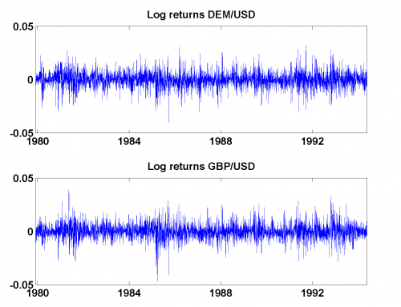

[](http://quantlet.de/)

## [](http://quantlet.de/) **MSRlog_returns** [](http://quantlet.de/)

```yaml

Name of Quantlet: MSRlog_returns

Published in: Measuring Statistical Risk

Description: 'Plots log-returns of DEM/USD and GBP/USD from 01.12.1979 to 01.04.1994.'

Keywords: log-returns, returns, financial, currency, exchange-rate, plot

Author: Zografia Anastasiadou
Author[Matlab]: Barbara Choros-Tomczyk

Datafiles: fx.dat
```



### R Code
```r


rm(list = ls(all = TRUE))
#setwd("C:/...")

x       = read.table('fx.dat')
x       = as.matrix(x)
returns = diff(log(x)) 
t       = seq(23, dim(x)[1], by = 4*257)

par(mfrow = c(2, 1))
plot(returns[, 1], type = "l", col = "blue", ylim = c(-0.05, 0.05), 
    xlab = "", ylab = "", main = "Log returns DEM/USD", xaxt = "n")
axis(1, at = t, labels = c(1980, 1984, 1988, 1992))
plot(returns[, 2], type = "l", col = "blue", ylim = c(-0.05, 0.05), 
    xlab = "", ylab = "", main = "Log returns GBP/USD", xaxt = "n")
axis(1, at = t, labels = c(1980, 1984, 1988, 1992))
```

automatically created on 2018-05-28

### MATLAB Code
```matlab


x       = load('fx.dat');
returns = diff(log(x)); 
t       = 23:4*257:length(x);

subplot(2, 1, 1)
plot(returns(:, 1))
set(gca, 'XTick', t);
set(gca, 'XTickLabel', {'1980' '1984' '1988' '1992'})
xlim([-1 length(x) + 1])
ylim([-0.05 0.05])
title('Log returns DEM/USD')
subplot(2, 1, 2)
plot(returns(:, 2))
set(gca, 'XTick', t);
set(gca, 'XTickLabel', {'1980' '1984' '1988' '1992'})
xlim([-1 length(x) + 1])
ylim([-0.05 0.05])
title('Log returns GBP/USD')
```

automatically created on 2018-05-28