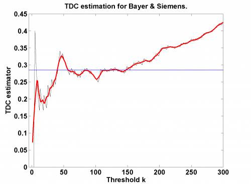
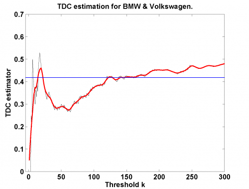

[](http://quantlet.de/)

## [](http://quantlet.de/) **MSRnonp_utd** [](http://quantlet.de/)

```yaml

Name of Quantlet: MSRnonp_utd

Published in: Measuring Statistical Risk

Description: 'Provides a nonparametric estimation of upper tail dependence coefficient by heuristic plateau-finding algorithm.'

Keywords: tail, dependence, nonparametric, nonparametric estimation, distribution

Author: Barbara Choros-Tomczyk

Submitted: Fri, May 30 2008 by Vladimir Georgescu

```






### MATLAB Code
```matlab


function MSRnonp_utd
close all;
x1 = load('BMW9906_standLogRet.dat');
x2 = load('Vow9906_standLogRet.dat');
x  = load('lambdaS_BmwVow.txt','-ascii');
l  = MSRnonp_utd_coef(x1, x2, x)
title('TDC estimation for BMW & Volkswagen.')

figure
x1 = load('Sie9906_standLogRet.dat');
x2 = load('Vow9906_standLogRet.dat');
x  = load('lambdaS_SieVow.txt','-ascii');
l  = MSRnonp_utd_coef(x1, x2, x)
title('TDC estimation for Siemens & Volkswagen.')

figure
x1 = load('Bay9906_standLogRet.dat');
x2 = load('Sie9906_standLogRet.dat');
x  = load('lambdaS_BaySie.txt','-ascii');
l  = MSRnonp_utd_coef(x1, x2, x)
title('TDC estimation for Bayer & Siemens.')


function lambda = MSRnonp_utd_coef(a,b,x)
T  = length(a);
s1 = tiedrank(a);
s2 = tiedrank(b);

for k = 1:T-1
    C = sum((s1 > (T - k)).*(s2 > (T - k)));
    lam(k) = C/k;
end

d = 300; %figure limit
z = lam(1:d);
plot(z,'k')
xlim([-5 d])
hold on

n        = size(x,2);
b        = floor(0.005*n);
m        = floor(sqrt(n - 2*b));
standDev = std(x(1:(n - 2*b)));

for k = 1:n - m - 2*b + 1
    if    sum(abs(x(k + 1:k + m-1) - x(k))) <= standDev;
        break
    end;
end;

lambda = sum(x(k:(k + m - 1)))./m;
plot(x(1:d), 'r', 'LineWidth', 2)
plot(-5:0.05:d, lambda, 'b')
hold off

xlabel('Threshold k');
ylabel('TDC estimator');

```

automatically created on 2018-05-28