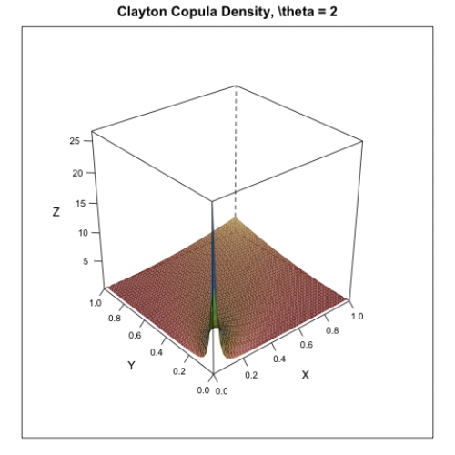

[](http://quantlet.de/)

## [](http://quantlet.de/) **MSRpdf_cop_Clayton** [](http://quantlet.de/)

```yaml

Name of Quantlet: MSRpdf_cop_Clayton

Published in: Measuring Statistical Risk

Description: 'Produces simple plot of the Clayton copula density with parameter p = 2.'

Keywords: 3D, clayton, copula, density, plot

Author: Zografia Anastasiadou


```



### R Code
```r


rm(list = ls(all = TRUE))
#setwd("C:/...")

#install.packages("lattice")
library(lattice)

u = seq(0,1,by=0.02)
v = u
m = length(u) 
n = length(v)
U = matrix(rep(u, each = n), nrow = n)
V = matrix(rep(v, m), nrow = n)

p = 2
gcopuly = (U^(-p) + V^(-p)-1)^(-2-1/p)*(U*V)^(-p-1)*(p+1)

s = expand.grid(u = u, v = v)
wireframe(gcopuly ~ u*v, s, shade = TRUE, xlab = "X", ylab = "Y",
    zlab = "Z", main = "Clayton Copula Density, theta = 2",
    scales = list(arrows = FALSE))
```

automatically created on 2018-05-28

### MATLAB Code
```matlab


function MSRpdf_cop_Clayton
[u,v]   = meshgrid(0:0.02:1);
p       = 2;
gcopuly = (u.^(-p) + v.^(-p)-1).^(-2-1/p).*(u.*v).^(-p-1).*(p+1);
grid on
mesh(u, v, gcopuly)
xlabel('X');
ylabel('Y');
zlabel('Z');
title('Clayton Copula Density, \\theta = 2')
```

automatically created on 2018-05-28