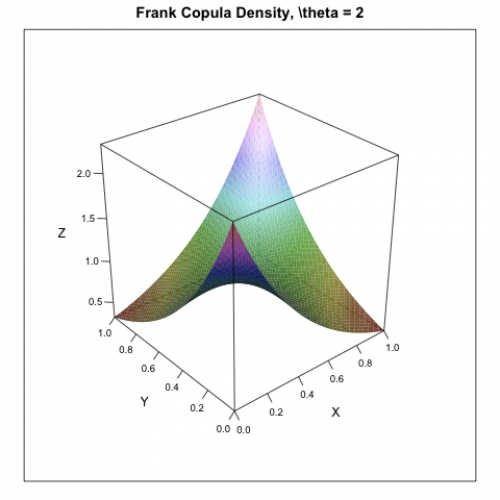

[](http://quantlet.de/)

## [](http://quantlet.de/) **MSRpdf_cop_Frank** [](http://quantlet.de/)

```yaml

Name of Quantlet: MSRpdf_cop_Frank

Published in: Measuring Statistical Risk

Description: 'Produces simple plot of the Frank copula density with parameter p = 2.'

Keywords: copula, pdf, density, tail, dependence

Author: Zografia Anastasiadou

See also: MSRpdf_cop_Clayton, MSRpdf_cop_Gumbel, MSRpdf_cop_tStudent


```



### R Code
```r

rm(list = ls(all = TRUE))
#setwd("C:/...")


#install.packages("lattice")
library(lattice)

u = seq(0, 1, by = 0.02)
v = u
m = length(u) 
n = length(v)
U = matrix(rep(u, each = n), nrow = n)
V = matrix(rep(v, m), nrow = n)

p = 2

gcopuly = -p*(exp(-p*(U+V+1)) - exp(-p*(U+V)))/ ((exp(-p) + exp(-p*(U+V)) - exp(-p*U) - exp(-p*V))^2)

s = expand.grid(u = u, v = v)
wireframe(gcopuly ~ u*v, s, shade = TRUE, xlab = "X", ylab = "Y", zlab = "Z", 
    main = "Frank Copula Density, \\theta = 2", scales = list(arrows = FALSE))
```

automatically created on 2018-05-28

### MATLAB Code
```matlab


function MSRpdf_cop_Frank
[u,v] = meshgrid(0:0.02:1);
p     = 2;

gcopuly = -p.*(exp(-p.*(u+v+1)) - exp(-p.*(u+v)))./...
    ((exp(-p) + exp(-p.*(u+v)) - exp(-p.*u) - exp(-p.*v)).^2);
grid on

mesh(u, v, gcopuly)
xlabel('X');
ylabel('Y');
zlabel('Z');
title('Frank Copula Density, \\theta = 2')
```

automatically created on 2018-05-28