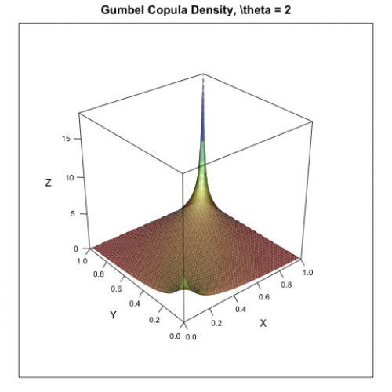

[](http://quantlet.de/)

## [](http://quantlet.de/) **MSRpdf_cop_Gumbel** [](http://quantlet.de/)

```yaml

Name of Quantlet: MSRpdf_cop_Gumbel 

Published in: Measuring Statistical Risk

Description: 'Produces a simple plot of the Gumbel copula density with parameter p = 2.'

Author: Zografia Anastasiadou

Keywords: copula, pdf, density, plot, graphical representation

See also: MSRpdf_cop_Clayton, MSRpdf_cop_Frank, MSRpdf_cop_tStudent
```



### R Code
```r

rm(list = ls(all = TRUE))
#setwd("C:/...")

#install.packages("lattice")
library(lattice)

u = seq(0, 1, by = 0.02)
v = u
m = length(u) 
n = length(v)
U = matrix(rep(u, each = n), nrow = n)
V = matrix(rep(v, m), nrow = n)

p   = 2
arg = (-log(U))^p + (-log(V))^p

gcopuly = exp(-arg^(1/p))/U/V * (log(U)*log(V))^(p-1) * arg^(1/p-2)*(p-1+arg^(1/p))

s = expand.grid(u = u, v = v)
wireframe(gcopuly ~ u*v, s, shade = TRUE, xlab = "X", ylab = "Y", zlab = "Z",
    main = "Gumbel Copula Density, \\theta = 2",scales = list(arrows = FALSE))
```

automatically created on 2018-05-28

### MATLAB Code
```matlab


function MSRpdf_cop_Gumbel

[u,v]   = meshgrid(0:0.02:1);
p       = 2;
arg     = (-log(u)).^p + (-log(v)).^p;
gcopuly = exp(-arg.^(1/p))./u./v.*(log(u).*log(v)).^(p-1).*...
    arg.^(1/p-2).*(p-1 + arg.^(1/p));
grid on

mesh(u, v, gcopuly)

xlabel('X');
ylabel('Y');
zlabel('Z');
title('Gumbel Copula Density, \\theta = 2')
```

automatically created on 2018-05-28