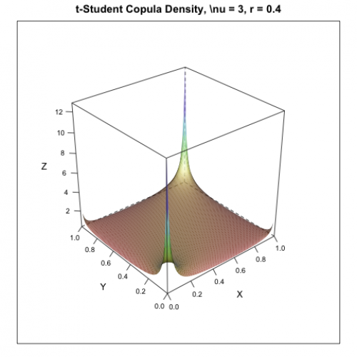

[](http://quantlet.de/)

## [](http://quantlet.de/) **MSRpdf_cop_tStudent** [](http://quantlet.de/)

```yaml

Name of Quantlet: MSRpdf_cop_tStudent

Published in: Measuring Statistical Risk

Description: 'Plots the t-Student copula density with parameter r = 0.4 and DoF = 3.'

Author: Zografia Anastasiadou

Keywords: copula, pdf, density, tail, risk, plot

See also: 'MSRpdf_cop_Clayton, MSRpdf_cop_Frank, MSRpdf_cop_Gumbel'


```



### R Code
```r


rm(list=ls(all=TRUE))
#setwd("C:/...")

#install.packages("lattice")
library(lattice)

v    = 3
r    = 0.4
wyzn = 1 - (r^2)
u    = seq(0, 1, by = 0.01)
w    = u
d    = length(u) 
n    = length(w)
U    = matrix(rep(u, each = n), nrow = n)
W    = matrix(rep(w,d), nrow = n)

y1   = qt(U, v)
y2   = qt(W, v)

y    = cbind(as.vector(y1), as.vector(y2))
R    = cbind(c(1, r), c(r, 1))

g    = (wyzn)^(-0.5)*gamma(v/2+1)*gamma(v/2)/gamma((v+1)/2)^2

d2   = d^2
c2   = (1:d^2)

for (i in 1:d^2){
	c2[i]=((1 + y[i,1]^2/v)*(1 + y[i,2]^2/v))^((v+1)/2)/
    (1 + (y[i, ]%*%solve(R)%*%y[i, ])/v)^(v/2 + 1)
	}
	
c = c2*g
f = matrix(c, nrow = d, byrow = T)
z = cbind(as.vector(U), as.vector(W), c)

s = expand.grid(u = u, w = w)
wireframe(f ~ u*w, s, shade = TRUE, xlab = "X", ylab = "Y", zlab = "Z", 
    main = "t-Student Copula Density, \\nu = 3, r = 0.4", scales = list(arrows = FALSE))
```

automatically created on 2018-05-28

### MATLAB Code
```matlab


function MSRpdf_cop_tStudent
    
v     = 3;
r     = 0.4;
wyzn  = 1-(r^2);
u     = [0:.01:1];
d     = length(u);
[u,w] = meshgrid(u);
y1    = tinv(u,v);
y2    = tinv(w,v);
y     = [y1(:),y2(:)];
R     = [1 r;r 1];
g     = (wyzn)^(-0.5).*gamma(v./2+1).*gamma(v./2)./gamma((v+1)./2).^2;

for i = 1:d^2
    c2(i) = ((1+y(i,1).^2./v).*(1+y(i,2).^2./v)).^((v+1)/2)./(1+(y(i,:)*inv(R)*y(i,:)')./v)^(v./2+1);
end;

c = c2*g;
f = reshape(c,d,[]); 
z = [u(:),w(:), c(:)];

figure;
mesh(u,w,f);
xlabel('X');
ylabel('Y');
zlabel('Z');
title('t-Student Copula Density, \\nu=3, r=0.4')
```

automatically created on 2018-05-28