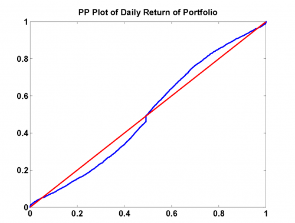

[](http://quantlet.de/)

## [](http://quantlet.de/) **MSRportfolio** [](http://quantlet.de/)

```yaml

Name of Quantlet: MSRportfolio

Published in: Measuring Statistical Risk

Description: 'Produces a PP and a QQ Plot of the Daily Return of the Portfolio.'

Author: Zografia Anastasiadou

Keywords: portfolio, pp-plot, qq-plot, returns, log-returns

See also: MSRportfolio_est

Datafiles: Portf9206_logRet.dat
```



### R Code
```r


rm(list = ls(all = TRUE))
#setwd("C:/...")

x    = read.table("Portf9206_logRet.dat")

n    = nrow(x)
xf   = apply(x, 2, sort)  

t    = (1:n)/(n+1);
dat1 = cbind(pnorm((xf - mean(xf))/sd(xf)), t)
dat2 = cbind(t, t)

#PP Plot
plot(dat1, col = "blue", ylab = "", xlab = "", main = "PP Plot of Daily Return of Portfolio")
lines(dat2, col = "red", lwd = 2)

#QQ Plot
qqnorm(xf, col = "blue", xlab = "", ylab = "", main = "QQ Plot of Daily Return of Portfolio")
qqline(xf, col = "red", lwd = 2)


```

automatically created on 2018-05-28

### MATLAB Code
```matlab


x    = load('Portf9206_logRet.dat');
n    = length(x);
xf   = sort(x);

t    = (1:n)/(n+1);
dat  = [normcdf((xf-mean(xf))/sqrt(var(xf))),t'];
dat2 = [t',t'];

hold on
figure(1)
scatter(dat(:, 1), dat(:,2), '.', 'b')
plot(dat2(:, 1), dat2(:, 2), 'r', 'LineWidth', 2)
title('PP Plot of Daily Return of Portfolio')
hold off

figure(2)
h = qqplot(xf)
set(h(1), 'Marker', '.')
set(h(3), 'LineStyle', '-')
set(h(3), 'LineWidth', 2)
title('QQ Plot of Daily Return of Portfolio')
xlabel('')
ylabel('')


```

automatically created on 2018-05-28