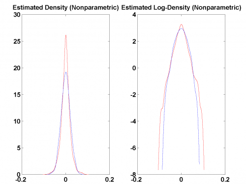

[](http://quantlet.de/)

## [](http://quantlet.de/) **MSRportfolio_est** [](http://quantlet.de/)

```yaml

Name of Quantlet: MSRportfolio_est

Published in: Measuring Statistical Risk

Description: 'Calculates and plots the daily log-returns of the portfolio from 1992 to 2006 and the estimated density and log-density, respectively (nonparametric), kernel density estimator, gaussian kernel, bandwidth given by Silverman''s rule-of-thumb.'

Keywords: Silverman, density, gaussian, kernel, returns

See also: 'MSR_TDC_tStudent, MSRbayer_log_returns, MSRbayer_log_returns, MSRevt3, MSRstdlogret, MSRtail_dep_normal, MSRtail_dep_tStudent, MSRvar_block_max, MSRvar_block_max_params, MSRvar_clayton_GARCHn'


Author: Zografia Anastasiadou
Author[Matlab]: 'Wolfgang K. Härdle, Barbara Choros-Tomczyk'

Submitted: Tue, March 16 2010 by Lasse Groth

Datafiles: 'Port9906_2kPoints_GARCHn_Inn.txt'
```



### R Code
```r


rm(list = ls(all = TRUE))
#setwd("C:/...")

#install.packages("KernSmooth")
library(KernSmooth)

portRet  =  read.table("Port9906_2kPoints_GARCHn_Inn.txt")
portRet  =  as.matrix(portRet)

dim(portRet)
r   =  length(portRet)

mu  =  mean(portRet)
si  =  sqrt(var(portRet))

set.seed(3)

x  =  si * rnorm(r) + mu
h  =  1.06 * si * (r^(-0.2))

par(mfrow = c(1, 2))

x1  =  bkde(portRet, bandwidth = h)
x2  =  bkde(x, bandwidth = h)

plot(x1, type = "l", col = "red", xlab = "", ylab = "", 
    main = "Estimated Density (Nonparametric)", 
    cex.main = 0.9)
lines(x2, col = "blue", lty = 2)

lfh  =  cbind(x1$x, log(x1$y))
lf   =  cbind(x2$x, log(x2$y))

plot(lfh, type = "l", col = "red", xlab = "", ylab = "", 
    main = "Estimated Log-Density (Nonparametric)", 
    cex.main = 0.9) 
lines(lf, col = "blue", lty = 2)
```

automatically created on 2018-05-28

### MATLAB Code
```matlab

close all
clear 
clc

portRet = load('Port9906_2kPoints_GARCHn_Inn.txt', '-ascii');
size(portRet)
r = length(portRet);

mu = mean(portRet);
si = sqrt(var(portRet));
x  = si*normrnd(0,1,r,1) + mu;         
h  = 1.06*si*(r^(-0.2));

subplot(1,2,1)
[f1,xi1] = ksdensity(portRet, 'width', h); 
[f2,xi2] = ksdensity(x, 'width', h);

hold on
plot(xi1, f1, 'r')
plot(xi2, f2, 'b', 'LineStyle', '--')
title('Estimated Density (Nonparametric)')
hold off

subplot(1, 2, 2)
lfh = [xi1', log(f1)'];
lf  = [xi2', log(f2)'];
hold on

plot(lfh(:, 1), lfh(:, 2), 'r')
plot(lf(:, 1), lf(:, 2), 'b', 'LineStyle', '--')
title('Estimated Log-Density (Nonparametric)')
hold off
```

automatically created on 2018-05-28