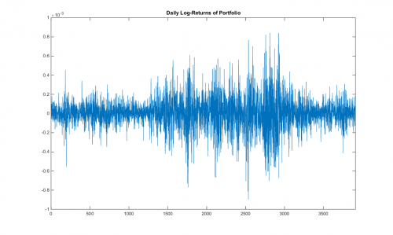

[](http://quantlet.de/)

## [](http://quantlet.de/) **MSRportfolio_log_returns** [](http://quantlet.de/)

```yaml

Name of Quantlet: MSRportfolio_log_returns

Published in: Measuring Statistical Risk

Description: 'Plots daily log-returns of the equally weighted portfolio of Bayer, BMW and Siemens from 1992-01-01 to 
2006-12-29.'

Keywords: financial, graphical representation, log-returns, portfolio, returns, time-series

See also: 'MSRbayer_log_returns, MSRbmw_log_returns, MSRbmw_log_returns, MSRbmw_log_returns, MSRsiemens_log_returns'

Author: Barbara Choros-Tomczyk , Lukas Borke

Submitted: Mon, July 06 2015 by Lukas Borke

Datafiles: Portf9206_logRet.dat
```



### MATLAB Code
```matlab


x = load('Portf9206_logRet.dat');
x = x/100;
plot(x);
xlim([-1 length(x) + 1])
title('Daily Log-Returns of Portfolio')

```

automatically created on 2018-05-28