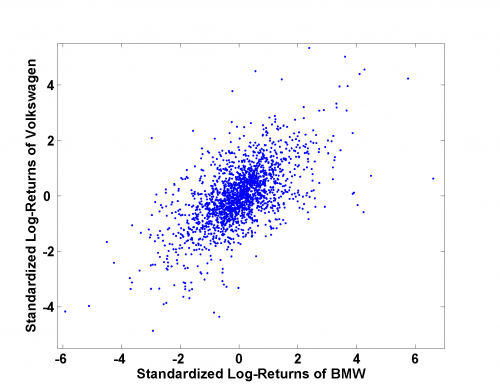

[](http://quantlet.de/)

## [](http://quantlet.de/) **MSRsca_bmw_vw** [](http://quantlet.de/)

```yaml

Name of Quantlet: MSRsca_bmw_vw

Published in: Measuring Statistical Risk

Description: 'Provides a scatterplot of daily standardized log-returns of BMW versus Volkswagen using data from 1999 to 2006.'

Keywords: returns, scatterplot, log-returns, financial, dax

Author: Ye Hua
Author[Matlab]: Barbara Choros-Tomczyk

Datafiles: 'BMW9906_standLogRet.dat, Vow9906_standLogRet.dat'

```



### R Code
```r

graphics.off()
rm(list = ls(all = TRUE))
#setwd("C:/...")

x1 = read.table("BMW9906_standLogRet.dat")
x2 = read.table("Vow9906_standLogRet.dat") 

plot(x1$V1, x2$V1, col = "blue", xlab = "Standardized Log-Returns of BMW",
    ylab = "Standardized Log-Returns of Volkswagen",
    xlim = c(-6.2, 7), ylim = c(-5.5, 5.5), pch = 20)
```

automatically created on 2018-05-28

### MATLAB Code
```matlab

x1 = load('BMW9906_standLogRet.dat');
x2 = load('Vow9906_standLogRet.dat');

scatter(x1, x2, '.')
xlabel('Standardized Log-Returns of BMW')
ylabel('Standardized Log-Returns of Volkswagen')
xlim([-6.2 7])
ylim([-5.5 5.5])
```

automatically created on 2018-05-28