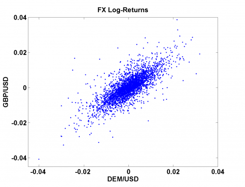

[](http://quantlet.de/)

## [](http://quantlet.de/) **MSRsca_log_returns** [](http://quantlet.de/)

```yaml

Name of Quantlet: MSRsca_log_returns

Published in: Measuring Statistical Risk

Description: 'MSRlog_returns plots the scatterplot of the log-returns of DEM/USD and GBP/USD from 01.12.1979 to 01.04.1994.'

Keywords: returns, scatterplot, financial, log-returns, dax, index, currency

Author: Zografia Anastasiadou
Author[Matlab]: Barbara Choros-Tomczyk

Datafiles: fx_dem_gbp_usd.dat
```



### R Code
```r


graphics.off()
rm(list = ls(all = TRUE))
# setwd('C:/...')

x       = read.table("fx_dem_gbp_usd.dat")
x       = as.matrix(x)
returns = diff(log(x))
t       = seq(23, nrow(x), by = 4 * 257)
 

plot(returns[, 1], returns[, 2], col = "blue", xlab = "DEM/USD", ylab = "GBD/USD", 
    xlim = c(-0.045, 0.04) , ylim = c(-0.045, 0.04), pch = 20)
```

automatically created on 2018-05-28

### MATLAB Code
```matlab


x       = load('fx_dem_gbp_usd.dat');
returns = diff(log(x)); 
t       = 23:4*257:length(x);

scatter(returns(:, 1), returns(:, 2), 'b', '.')
title('FX Log-Returns')
xlabel('DEM/USD');
ylabel('GBP/USD');
xlim([-0.045 0.04])
ylim([-0.045 0.04])

```

automatically created on 2018-05-28