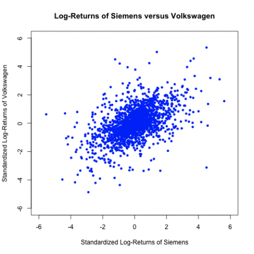

[](http://quantlet.de/)

## [](http://quantlet.de/) **MSRsca_sie_vw** [](http://quantlet.de/)

```yaml

Name of Quantlet: MSRsca_sie_vw

Published in: Measuring Statistical Risk

Description: 'Provides a scatterplot of daily standardized log-returns of Siemens versus Volkswagen.'

Author: Zografia Anastasiadou

Keywords: returns, scatterplot, log-returns, financial, dax

See also: MSRbayer_log_returns, MSRbmw_log_returns

Submitted: Tue, April 05 2011 by Maria Osipenko

Datafiles: Sie9906_standLogRet.dat, Vow9906_standLogRet.dat
```



### R Code
```r

graphics.off()
rm(list=ls(all=TRUE))
#setwd("C:/...")

x1 = read.table("Sie9906_standLogRet.dat")
x2 = read.table("Vow9906_standLogRet.dat") 

plot(x1$V1, x2$V1, col = "blue", xlab = "Standardized Log-Returns of Siemens", 
    ylab = "Standardized Log-Returns of Volkswagen", 
    main = "Log-Returns of Siemens versus Volkswagen", 
    xlim = c(-6, 6), ylim = c(-6, 6), pch = 20)
```

automatically created on 2018-05-28

### MATLAB Code
```matlab

x1 = load('Sie9906_standLogRet.dat');
x2 = load('Vow9906_standLogRet.dat');

scatter(x1, x2, '.', 'b')
title('Log-Returns of Siemens versus Volkswagen')
xlabel('Standardized Log-Returns of Siemens')
ylabel('Standardized Log-Returns of Volkswagen')
xlim([-8 8])
ylim([-8 8])
```

automatically created on 2018-05-28