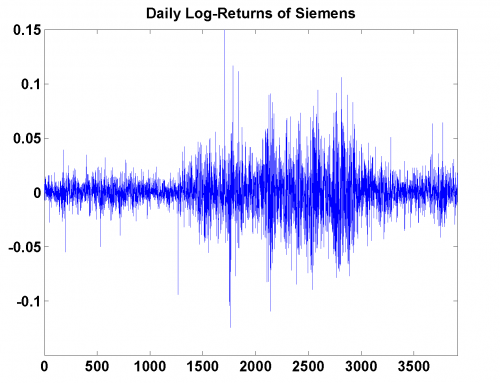

[](http://quantlet.de/)

## [](http://quantlet.de/) **MSRsiemens_log_returns** [](http://quantlet.de/)

```yaml

Name of Quantlet: MSRsiemens_log_returns

Published in: Measuring Statistical Risk

Description: 'Plots daily log-returns of the Siemens stock from 1992-01-01 to 2006-12-29.'

Keywords: returns, log-returns, financial, dax, empirical, plot

See also: 'MSRbayer_log_returns, MSRbmw_log_returns, MSRbmw_log_returns, MSRbmw_log_returns, MSRportfolio_log_returns, MSRsca_bmw_vw'

Author: Ye Hua
Author[Matlab]: Barbara Choros-Tomczyk

Datafiles: siemens_log_returns.dat
```



### R Code
```r


graphics.off()
rm(list = ls(all = TRUE))
#setwd("C:/...") 

x = read.table("siemens_log_returns.dat")

plot(x[, 2], xlim = c(-1, length(x[, 2]) + 1), ylim = c(-0.15, 0.15), 
    main = "Daily Log-Returns of Siemens", type = "l", col = "blue", xlab = "", ylab = "")
```

automatically created on 2018-05-28

### MATLAB Code
```matlab


x = load('siemens_log_returns.dat');
plot(x(:, 2))
xlim([-1 length(x)+1])
ylim([-0.15 0.15])
title('Daily Log-Returns of Siemens')
```

automatically created on 2018-05-28