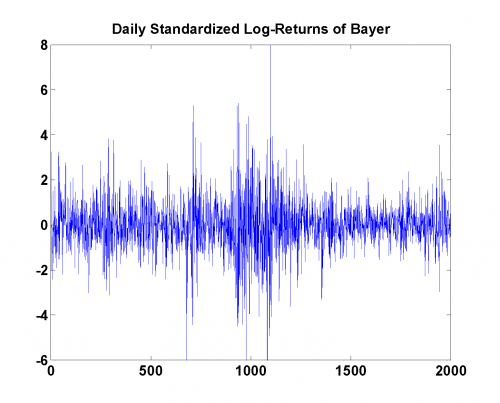
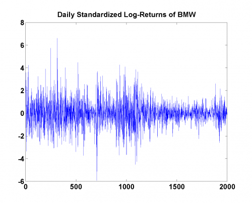
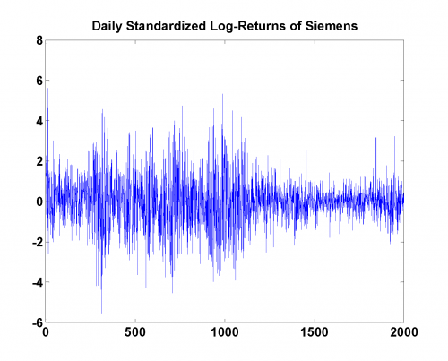
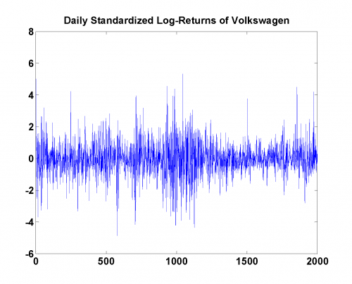

[](http://quantlet.de/)

## [](http://quantlet.de/) **MSRstdlogret** [](http://quantlet.de/)

```yaml

Name of Quantlet: MSRstdlogret

Published in: Measuring Statistical Risk

Description: 'Plots the standardized log-returns of Bayer, BMW, Siemens and Volkswagen. Uses data from 1999 to 2006.'

Keywords: financial, returns, log-returns, dax, time-series, plot

See also: 'MSR_TDC_tStudent, MSRbayer_log_returns, MSRbayer_log_returns, MSRevt3, MSRportfolio_est, MSRtail_dep_normal, MSRtail_dep_tStudent, MSRvar_block_max, MSRvar_block_max_params, MSRvar_clayton_GARCHn'

Author[Matlab]: 'Barbara Choros-Tomczyk , Wolfgang K. Härdle'
Author: Zografia Anastasiadou

Datafiles: 'BMW9906_standLogRet.dat, Bay9906_standLogRet.dat, Sie9906_standLogRet.dat, Vow9906_standLogRet.dat'

```









### R Code
```r


graphics.off()
rm(list = ls(all = TRUE))
#setwd("C:/...")

x1 = read.table("Bay9906_standLogRet.dat")
x2 = read.table("BMW9906_standLogRet.dat")
x3 = read.table("Sie9906_standLogRet.dat")
x4 = read.table("Vow9906_standLogRet.dat")

plot(x1[, 1], ylim = c(-6, 8), main = "Daily Standardized Log-Returns of Bayer",
    type = "l", col = "blue", xlab = "", ylab = "")
plot(x2[, 1], ylim = c(-6, 8), main = "Daily Standardized Log-Returns of BMW",
    type = "l", col = "blue", xlab = "", ylab = "")
plot(x3[, 1], ylim = c(-6, 8), main = "Daily Log-Returns of Siemens",
    type = "l", col = "blue", xlab = "", ylab = "")
plot(x4[, 1], ylim = c(-6, 8), main = "Daily Standardized Log-Returns of Volkswagen",
    type = "l", col = "blue", xlab = "", ylab = "")
```

automatically created on 2018-05-28

### MATLAB Code
```matlab


x1 = load('Bay9906_standLogRet.dat');
x2 = load('BMW9906_standLogRet.dat');
x3 = load('Sie9906_standLogRet.dat');
x4 = load('Vow9906_standLogRet.dat');

figure(1);plot(x1);ylim([-6 8]);title('Daily Standardized Log-Returns of Bayer');
figure(2);plot(x2);ylim([-6 8]);title('Daily Standardized Log-Returns of BMW');
figure(3);plot(x3);ylim([-6 8]);title('Daily Standardized Log-Returns of Siemens');
figure(4);plot(x4);ylim([-6 8]);title('Daily Standardized Log-Returns of Volkswagen');

```

automatically created on 2018-05-28