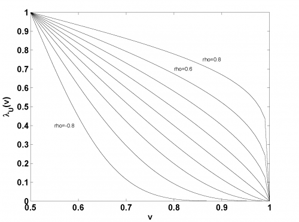

[](http://quantlet.de/)

## [](http://quantlet.de/) **MSRtail_dep_normal** [](http://quantlet.de/)

```yaml

Name of Quantlet: MSRtail_dep_normal

Published in: Measuring Statistical Risk

Description: 'Plots the function 2 * P{X_1 > F^(-1)_1(v) | X_2 = F^(-1)_2(v)} for a bivariate normal distribution with correlation coeffcients -0.8, -0.6, . . . , 0.6, 0.8.'

Author: Zografia Anastasiadou

Keywords: bivariate, normal, multivariate, distribution, plot

See also: 'MSR_TDC_tStudent, MSRbayer_log_returns, MSRbayer_log_returns, MSRevt3, MSRportfolio_est, MSRstdlogret, MSRtailGPareto, MSRtailHill, MSRtail_dep_tStudent, MSRvar_block_max, MSRvar_block_max_params, MSRvar_clayton_GARCHn'
```



### R Code
```r


rm(list=ls(all=TRUE))
#setwd("C:/...")

rho = seq(-0.8,0.8,by=0.2)
n   = length(rho)
v   = seq(0.5,1,by=0.01)

lambda = matrix(1,nrow = length(v), ncol = length(rho))
for (i in 1:n){
	sigma = 1-rho[i]^2
	sigma = sqrt(sigma)
	lambda[,i] = 2*(1-pnorm(qnorm(v)*sqrt(1-rho[i])/sqrt(1+rho[i])))
	}

v1 = matrix(v, nrow = length(v), ncol = length(rho))
plot(v1, lambda, type = "l", xlab = "v", ylab = expression(lambda[U](v)))
text(0.55,0.4, "rho=-0.8")
text(0.82,0.7, "rho=0.6")
text(0.88,0.75, "rho=0.8")
```

automatically created on 2018-05-28

### MATLAB Code
```matlab


function MSRtail_dep_normal
close all
rho = -0.8:0.2:0.8;
n   = length(rho);

for i = 1:n
    v      = 0.5:0.01:1;
    sigma  = 1-rho(i)^2;
    sigma  = sqrt(sigma);
    lambda = 2*(1 - normcdf(norminv(v)*sqrt(1 - rho(i))/sqrt(1 + rho(i))));

%lambda
hold on
plot(v, lambda, 'k');
hold off
text(0.55, 0.4, 'rho=-0.8')
text(0.8, 0.7, 'rho=0.6')
text(0.86, 0.75, 'rho=0.8')
xlabel('v')
ylabel('lambda_U(v)')
end
```

automatically created on 2018-05-28