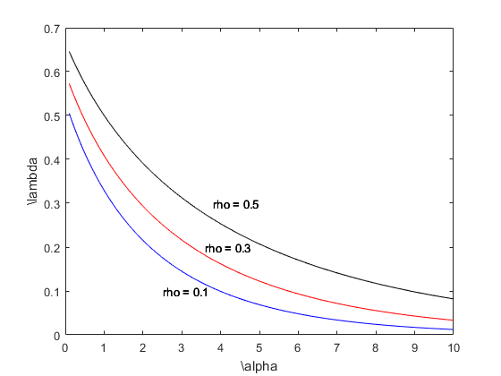

[](http://quantlet.de/)

## [](http://quantlet.de/) **MSRtaildepVsVarIndex** [](http://quantlet.de/)

```yaml

Name of Quantlet: MSRtaildepVsVarIndex

Published in: Measuring Statistical Risk

Description: 'Plots tail-dependence coefficient lambda versus regular variation index alpha for correlation coefficients rho = 0.5, 0.3, 0.1.'

Author: Barbara Choros

Keywords: correlation, tail area (of a distribution), tail, risk, dependence, distribution

See also: MSRtaildep_tcdf

```



### MATLAB Code
```matlab


function MSRtaildepVsVarIndex

clc;
close all;

alpha  = 0.1:0.1:10;
n      = length(alpha);
RHO    = [0.1,0.3,0.5];
colors = ['b','r','k'];

for j = 1:3
    rho = RHO(j);

for i = 1:n
    a = alpha(i);

upbond     = fun(rho);
p          =  quad(@myfun, 0, upbond, [], [], a);
q          =  quad(@myfun, 0, 1, [], [], a);
lambda(i)  =  p/q;
end

plot(alpha, lambda, colors(j))
xlabel('\\alpha')
ylabel('\\lambda')
text(3.8, 0.3, 'rho = 0.5')
text(3.6, 0.2, 'rho = 0.3')
text(2.5, 0.1, 'rho = 0.1')
hold on
end

function y  =  myfun(x, a) 
y = x.^a./sqrt(1 - x.^2);

function h = fun(r)
h = ( 1 + ((1-r)^2/(1 - r^2)))^(-1/2);
```

automatically created on 2018-05-28