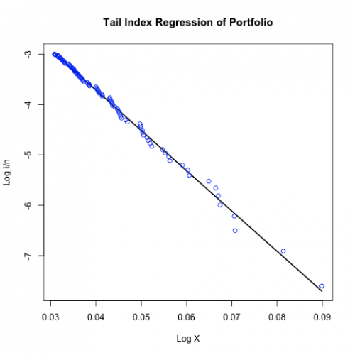

[](http://quantlet.de/)

## [](http://quantlet.de/) **MSRtailport** [](http://quantlet.de/)

```yaml

Name of Quantlet: MSRtailport

Published in: Measuring Statistical Risk

Description: 'Plots the right tail of the logarithmic empirical distribution of the portfolio (Bayer, BMW, Siemens) returns from 1992-01-01 to 2006-09-21.'

Keywords: financial, portfolio, tail, risk, distribution, dax

Author: Zografia Anastasiadou

Datafiles: 'Bay9906_close_2kPoints.txt, Bmw9906_close_2kPoints.txt, Sie9906_close_2kPoints.txt'

```



### R Code
```r


rm(list = ls(all = TRUE))
setwd("C:/....")

a = read.table("Bay9906_close_2kPoints.txt")
b = read.table("Bmw9906_close_2kPoints.txt")
c = read.table("Sie9906_close_2kPoints.txt")

d = a + b + c                         
l = dim(d)
x = log(d[-l[1], 1])-log(d[-1, 1]) #negative log-returns

n = length(x)
x = sort(x, decreasing  =  TRUE)
m = 100

#Generalized least squares method
x  = x[1:m]
x1 = cbind(matrix(1, m, 1),x)
y1 = log(seq(1, m)/n)
g  = solve(t(x1)%*%x1)%*%(t(x1)%*%y1)

line  = g[1] + g[2]*x
alpha = - g[2]
gamma = 1/alpha
out   = cbind(x, line)

plot(out[, 1], out[, 2], type = "l", xlab = ("Log X"), ylab = ("Log i/n"), 
    main = "Tail Index Regression of Portfolio",lwd = 2)
points(x, y1, col = "blue")


```

automatically created on 2018-05-28