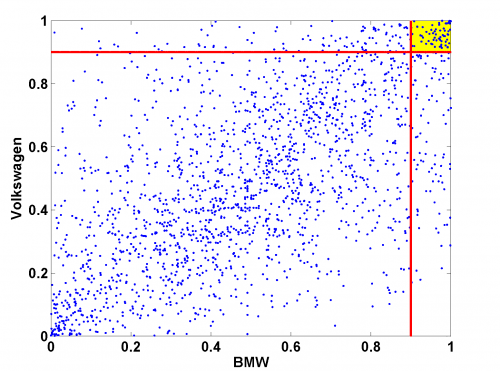

[](http://quantlet.de/)

## [](http://quantlet.de/) **MSRutd_bmw_vw** [](http://quantlet.de/)

```yaml

Name of Quantlet: MSRutd_bmw_vw

Published in: Measuring Statistical Risk

Description: 'Provides a scatterplot of daily standardized log-returns of BMW versus Volkswagen.'

Keywords: financial, time-series, dax, empirical, log-returns, returns

Author: Zografia Anastasiadou

Datafiles: 'BMW9906_standLogRet.dat, Vow9906_standLogRet.dat'
```



### R Code
```r


rm(list = ls(all = TRUE))
#setwd("C:/...")

x1 = read.table("BMW9906_standLogRet.dat")
x2 = read.table("Vow9906_standLogRet.dat")

x1 = pt(x1[,1], 8)
x2 = pt(x2[,1], 7)

x  = c(0.9, 0.9, 1.1, 1.1)
y  = c(0.9, 1.1, 1.1, 0.9)

plot(x1, x2, pch = 20, col = "blue", xlab = "BMW", ylab = "Volkswagen")
abline(h = 0.9, v = 0.9, col = "red", lwd = 3)
polygon(x, y, col = "yellow", density = 10)
```

automatically created on 2018-05-28

### MATLAB Code
```matlab

x1 = load('BMW9906_standLogRet.dat');
x2 = load('Vow9906_standLogRet.dat');
x1 = tcdf(x1,8);
x2 = tcdf(x2,7);
x  = [0.9; 0.9; 1; 1];
y  = [0.9; 1; 1; 0.9];
fill(x, y, 'y')
hold on
scatter(x1, x2, '.')
plot(0.9, [0:0.001:1], 'r', 'LineWidth', 2)
plot([0:0.001:1], 0.9, 'r', 'LineWidth', 2)
hold off
xlabel('BMW')
ylabel('Volkswagen')

```

automatically created on 2018-05-28