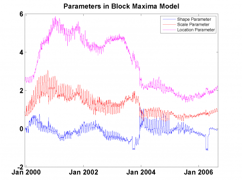

[](http://quantlet.de/)

## [](http://quantlet.de/) **MSRvar_block_max_params** [](http://quantlet.de/)

```yaml

Name of Quantlet: MSRvar_block_max_params

Published in: Measuring Statistical Risk

Description: 'Provides parameters estimated for calculating Value-at-Risk with Block Maxima Model. Insert b- location parameter, k- shape parameter, a- scale parameter'

Keywords: VaR, block-maxima, extreme-value, risk, financial

See also: 'MSR_TDC_tStudent, MSRbayer_log_returns, MSRbayer_log_returns, MSRevt3, MSRportfolio_est, MSRstdlogret, MSRtail_dep_normal, MSRtail_dep_tStudent, MSRvar_block_max, MSRvar_clayton_GARCHn'

Author: 'Barbara Choros-Tomczyk , Wolfgang K. Härdle'

Datafiles: 'alpha_bMax_Portf.txt, beta_bMax_Portf.txt, kappa_bMax_Portf.txt'
```



### R Code
```r


rm(list = ls(all = TRUE))
#setwd("C:/...")

k  =  t(read.table("kappa_bMax_Portf.txt"))
a  =  t(read.table("alpha_bMax_Portf.txt"))
b  =  t(read.table("beta_bMax_Portf.txt"))

plot(k, type = "l", col = "blue", ylim = c(-1, 6), ylab = "", xlab = "", main = "Parameters in Block Maxima Model", axes = FALSE)
lines(a, col = "red")
lines(b, col = "magenta")
box()
axis(1, c(261, 521, 782, 1043, 1304, 1566, 1826)-250, c("Jan 2000", "Jan 2001", "Jan 2002", "Jan 2003", "Jan 2004", "Jan 2005", "Jan 2006"))
axis(2)
legend("topright", c("Shape Parameter", "Scale Parameter", "Location Parameter"), pch = c(15, 15, 15), col = c("blue", "red", "magenta"))
```

automatically created on 2018-05-28

### MATLAB Code
```matlab

function MSRvar_block_max_params
clc;
close all;
k = load('kappa_bMax_Portf.txt', '-ascii');
a = load('alpha_bMax_Portf.txt', '-ascii');
b = load('beta_bMax_Portf.txt', '-ascii');
%^^^^^^^^^^^^^^^^^^^^^^^^^^^^^^^^^^^^^^^^^^^PLOTS
plot(k)
grid on
hold on
plot(a,'Color', 'red')
plot(b,'Color', 'm');
hold off
legend('Shape Parameter','Scale Parameter','Location Parameter')
title('Parameters in Block Maxima Model')
xlim([-3 1755])%xlim([-1.5 1752])
set(gca,'XTick',[261 521 782 1043 1304 1566 1826]-250)
set(gca,'XTickLabel',{'Jan 2000' 'Jan 2001' ...
   'Jan 2002' 'Jan 2003' 'Jan 2004' 'Jan 2005' 'Jan 2006'})
```

automatically created on 2018-05-28